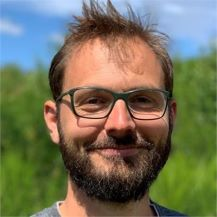

    

        <h2 class="border-0">Andreas Schmidt Jensen</h2>
        
Master of Science in Engineering, PhD

        
Date of birth: September 2, 1986

        

            <i>Experienced software engineer and data scientist. Strong theoretical foundation with a solid understanding of business. I excel at bringing visions to life - both at a strategic and implementation level.</i>
        

        

            I live in Albertslund just outside Copenhagen with my wife, Eva and our daughters, Rebekka og Leonora.
        

    

    

        
Last update: February 19, 2019

        
    

## Work Experience

#### LINK Mobility

`2017—now`
**Head of Mobile Intelligence Technology**
> I am the chief scientist in LINK Mobility, responsible for all things technology, analytics, statistics and AI in LINK Mobility Group. All of this is consolidated in the Mobile Intelligence area, where I work closely together with my commercial counterpart. 
>
> My work includes:
> - Consolidation of business data in data lake
> - Statistical analyses
> - AI and Machine learning
> - Automated reporting tools (both internal and external)
> - Next-generation AI possibilities
>
> I have built prediction algorithms for targeting the right end users with mobile offers (i.e. predict the probability of conversion). I work with unsupervised learning and cognitive computing for unstructured text to offer solutions that use the contents of SMS messages to improve results.

`2016—2017`
**Director of Technology (CTO), LINK Mobility Denmark**
> In 2016, Responsfabrikken was acquired by LINK Mobility Group. I continued in my role as CTO until 2017.

#### Responsfabrikken    

`2015—2016`
**CTO**
> After completing my PhD, I returned as CTO. I was responsible for a team of 6 developers (backend and frontend). I worked closely together with our sales team and project management team. 

`2010—2012`
**Systems Developer**
> After graduating, I was part of the team that designed and implemented our first SMS flow-builder, and was responsible for improving and maintaining our SMS gateway. 

`2009—2010`
**Java Developer**
> I started at Responsfabrikken as a student developer, working part-time. 

Other work experience

`2006-2009`
**Developer and internal supporter**
_National Research Centre for the Working Environment_

`2003-2008`
**Developer**
_Try Us ApS_

## Education

`2012-2015`
**PhD in Computer Science**
_Technical University of Denmark_
Thesis: "The AORTA Reasoning Framework: Adding Organizational Reasoning to Agents"

`2008-2010`
**M.Sc.Eng., Computer Science and Engineering**
_Technical University of Denmark_
Specialization: Efficient and Intelligent Software
Thesis: "Multi-Agent Systems: An Investigation of the Advantages of Making Organizations Explicit"

`2005-2008`
**Bachelor of Science in Engineering, Software Technology**
_Technical University of Denmark_
Thesis: "Textual Similarity: Comparing texts in order to discover how closely they discuss the same topics"

`2002-2005`
**Mathematical student**
_Gladsaxe Gymnasium, Denmark_

## Skills

IT

Java, C#, Python (with Pandas), R, Apache Spark and Hive, Relational databases (primarily MySQL and SQL Server), Prolog, JavaScript (including experience with frameworks such as Vue.js and Angular)

Languages

Danish, English, Norwegian, Swedish

## Courses and Further Education

`2018`
**Deep Learning (Coursera)**

`2017`
**Data Science Specialization (Coursera)**

`2016`
**Big Data (IDA Learning)**

`< 2010`
**At Technical University of Denmark**
* Logic in Artificial Intelligence and Multi-Agent Systems
* Artificial Intelligence and Multi-Agent Systems
* Distributed Systems   
* Computationally Hard Problems
* Neural Networks and Soft Computing
* Parallel Systems
* Introduction to Artificial Intelligence
* Algorithms and Data Structures

